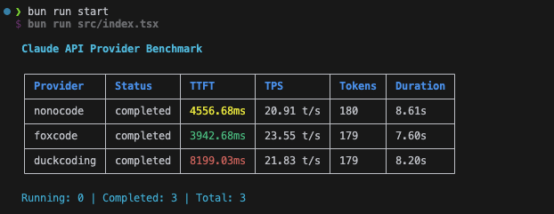

# ccbench

一个 Claude Code API 性能基准测试工具，用于测试不同提供商的响应速度和质量。



## 功能特性

- 🚀 **并发测试**: 同时测试多个 Claude Code 提供商
- ⚡ **性能指标**: 测量首字符响应时间 (TTFT) 和每秒令牌数 (TPS)
- 📊 **实时显示**: 终端 UI 实时显示测试进度和结果
- 🔧 **灵活配置**: 支持自定义 API 端点和认证令牌

## 安装依赖

```bash
bun install
```

## 配置文件

在项目根目录创建 `config.yml` 文件，配置要测试的 API 提供商：

```yaml
providers:
  - name: provider1
    authToken: your_auth_token_1
    baseURL: https://api.provider1.com/v1
  - name: provider2
    authToken: your_auth_token_2
    baseURL: https://api.provider2.com/v1
  - name: provider3
    authToken: your_auth_token_3
    baseURL: https://api.provider3.com/v1
```

### 配置说明

- `name`: 提供商名称（用于显示）
- `authToken`: API 认证令牌
- `baseURL`: API 基础 URL

## 运行测试

```bash
bun run start
# 或
bun run dev
```

## 输出说明

测试运行时会显示：

- **Provider**: 提供商名称
- **Status**: 当前状态（pending/running/completed）
- **TTFT**: 首字符响应时间（毫秒）
- **TPS**: 每秒令牌数
- **Duration**: 总响应时间（毫秒）
- **Tokens**: 生成的令牌总数
- **Error**: 错误信息（如果有）

## 技术栈

- **运行时**: [Bun](https://bun.com) - 快速的 JavaScript 运行时
- **UI**: React + [Ink](https://github.com/vadimdemedes/ink) - 终端 UI 框架
- **API**: [Anthropic SDK](https://github.com/anthropics/anthropic-sdk-typescript) - Claude API 客户端
- **语言**: TypeScript

## 注意事项

- 确保所有 API 令牌具有访问 Claude API 的权限
- 测试使用固定的消息内容来确保结果一致性
- 默认超时时间为 30 秒
- 测试完成后程序会自动退出
